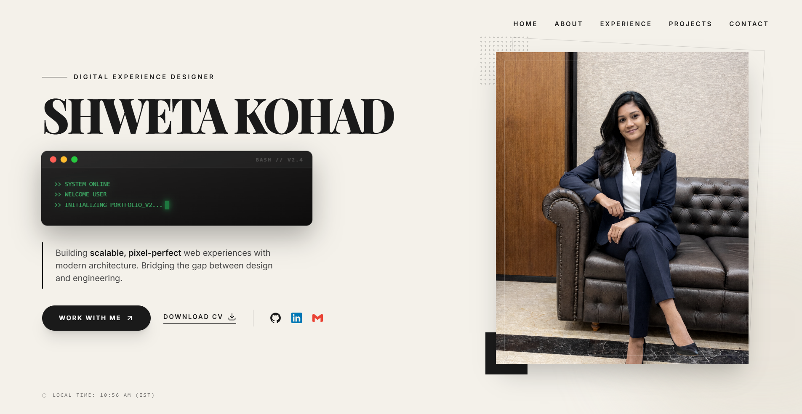
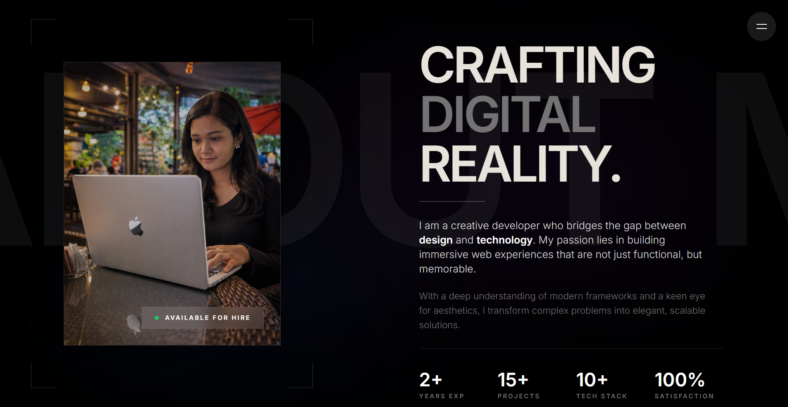
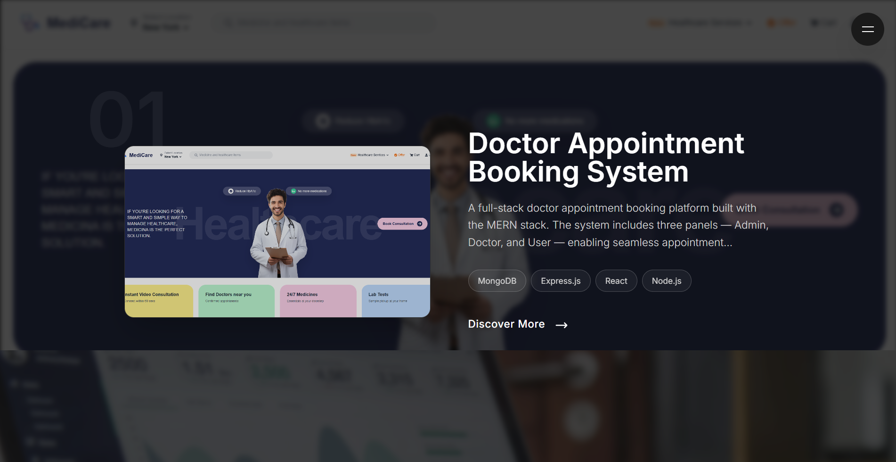
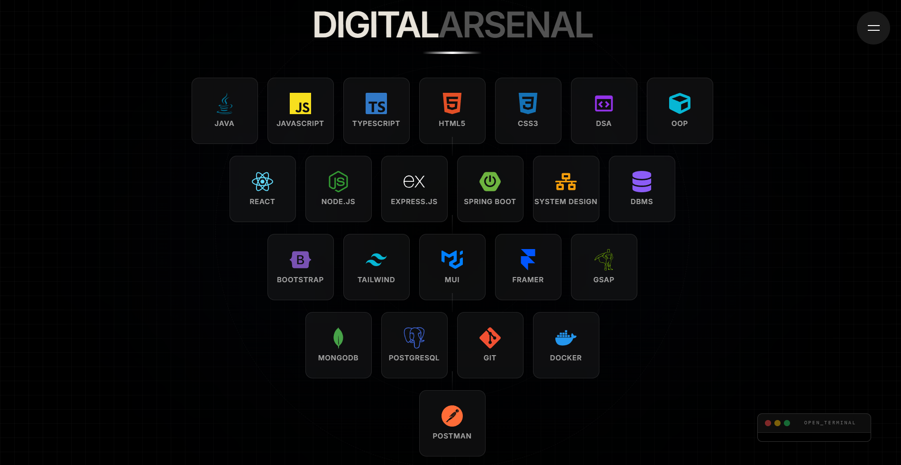
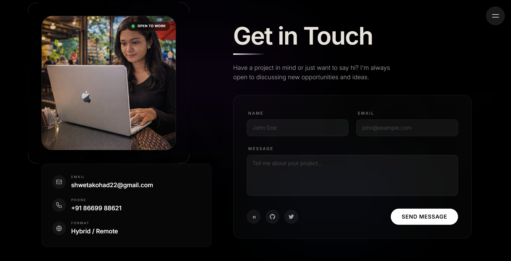

# 🌐 Shweta Kohad - Developer Portfolio

<p align="center">
  
</p>

<p align="center">
  <a href="https://www.shwetakohad.in/">
    
  </a>
  
  
  
</p>

---

## About This Portfolio

This portfolio showcases my skills, projects, certifications, and contact details with a modern, responsive UI.

---

## Website Sections

- About  
- Skills  
- Projects  
- Certifications  
- Contact  

---

## Tech Stack

- React.js  
- Tailwind CSS  
- Framer Motion (Animations)  

---

## Key Features

- Responsive and mobile-friendly  
- Smooth animated transitions  
- Clean codebase with reusable components  

---


## Screenshots Preview

Below are screenshots from the portfolio website in a neat collage format:

<p align="center">
  &nbsp;
  
</p>

<p align="center">
  &nbsp;
  
</p>

<p align="center">
  
</p>

## Installation

```bash
# Clone the repository
git clone <your-repo-link>

# Navigate to project folder
cd Portfolio-framerMotion

# Install dependencies
npm install

# Run development server
npm run dev
